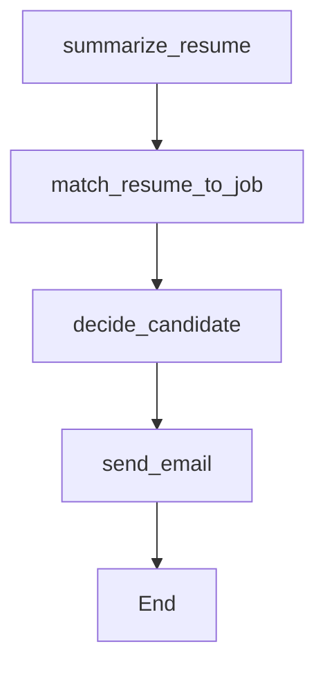

# 🧠 Automated Resume Triage & Shortlisting System

An end-to-end **AI-powered Resume Screening System** that automates the process of resume parsing, job-role matching, candidate evaluation, and sending personalized emails — powered by **FastAPI**, **Streamlit**, **LangGraph**, and **Google Gemini 2.5 Flash**.

---

## 🚀 Overview

This system allows recruiters to post job requirements and candidates to upload resumes.
The backend automatically extracts, summarizes, evaluates, and classifies each resume based on the job description — assigning a score and generating a hiring decision (**Accept/Reject**).

It also auto-generates and sends a personalized email to the candidate — all in one seamless flow.

---

## 🧩 System Workflow

```
Recruiter → Streamlit (Frontend)
     ↓
FastAPI (Backend)
     ↓
LangGraph Workflow:
    1️⃣ Summarize Resume (Gemini)
    2️⃣ Match Resume to Job
    3️⃣ Apply Decision Threshold
    4️⃣ Generate & Send Email
     ↓
Candidate receives email 📬
```

## 🧠 Features

### ✅ Resume Upload & Parsing

* Upload resume as PDF (or DOCX)
* Text extraction using PyMuPDF / pdfplumber

### ✅ LLM-Powered Resume Summarization

* Uses **Google Gemini 2.5 Flash** for structured summarization
* Extracts summary, skills, experience, and education

### ✅ Automated Matching

* Matches candidate’s skills to recruiter job description
* Generates score (0–100) and reasoning

### ✅ Decision Automation

* Score ≥ 70 → **Accepted**
* Score < 70 → **Rejected**
* Adds feedback reasoning

### ✅ Email Automation

* Automatically drafts and sends personalized emails
* Uses SMTP (e.g. Gmail) with credentials from `.env`

### ✅ Interactive Frontend

* Built with **Streamlit**
* Separate Recruiter and Candidate sections
* Displays LLM summary, score, decision, and email preview

---

## 🧰 Tech Stack

| Component       | Technology                 |
| --------------- | -------------------------- |
| Frontend        | Streamlit                  |
| Backend         | FastAPI + Uvicorn          |
| LLM Integration | Google Gemini 2.5 Flash    |
| Workflow Engine | LangGraph                  |
| Orchestration   | LangChain for Google GenAI |
| File Parsing    | PyMuPDF / pdfplumber       |
| Email           | SMTP via Python            |
| Configuration   | python-dotenv              |

---

## ⚙️ Installation & Setup

### 1️⃣ Create Virtual Environment

```bash
python -m venv vir-env
vir-env\Scripts\activate   # On Windows

# OR
source vir-env/bin/activate  # On Mac/Linux
```

### 2️⃣ Install Dependencies

```bash
pip install -r requirements.txt
```

---

## 🔑 Environment Variables

Create a `.env` file in your project root and add the following:

```bash
# Google Gemini API
GOOGLE_API_KEY=your_google_api_key_here

# Email configuration
EMAIL_HOST=smtp.gmail.com
EMAIL_PORT=587
EMAIL_USER=your_email@gmail.com
EMAIL_PASS=your_app_password
EMAIL_SEND=true
```

---

## 💡 How to Get Your Gmail App Password

1. Enable **2-Step Verification** in your Google Account → Security
2. Create an **App Password** → Select “Mail” and “Other (Custom Name)”
3. Copy the 16-character password and use it as `EMAIL_PASS`

---

## ▶️ Running the Project

### Step 1: Start the Backend

```bash
python backend/main.py
```

**Backend runs on:** [http://localhost:8000](http://localhost:8000/)

### Step 2: Start the Frontend

```bash
streamlit run frontend/app.py
```

**Frontend runs on:** [http://localhost:8501](http://localhost:8501/)

---

## 🧠 LangGraph Workflow Overview

| Node                    | Description                                                 |
| ----------------------- | ----------------------------------------------------------- |
| `summarize_resume`    | Uses Gemini to summarize resume into structured JSON        |
| `match_resume_to_job` | Compares summary with job description and rates 0–100      |
| `decide_candidate`    | Applies threshold (≥70 → Accept, else Reject)             |
| `send_email`          | Generates and sends personalized acceptance/rejection email |



---

## 📬 Email Sending

Emails are automatically sent after decision-making.

### ✅ Accepted Email Example

**Subject:** Application Update — Your Result: Accepted

```
Dear [Candidate],

Congratulations! 🎉
After reviewing your resume, we are pleased to inform you that your profile has been shortlisted.

Your evaluation score: 92/100
Feedback: Strong match — consider inviting the candidate for an interview.

Regards,
HR Team
```

---

### ❌ Rejected Email Example

**Subject:** Application Update — Your Result: Rejected

```
Dear [Candidate],

Thank you for applying for this position.
After evaluation, we regret to inform you that your profile was not shortlisted at this time.

Your evaluation score: 58/100
Feedback: Profile does not fully meet role requirements.

Regards,
HR Team
```

---

## 🧪 Testing

* Test FastAPI endpoints via Swagger UI: [http://localhost:8000/docs](http://localhost:8000/docs)
* Upload resumes (PDF or Doc format) in Streamlit
* Modify recruiter job descriptions to test scoring and decision logic

---

## 🔮 Future Enhancements

* Add database integration (SQLite / PostgreSQL) for storing candidate records
* Implement recruiter dashboard for shortlisting overview
* Integrate keyword-based ATS optimization
* Add analytics for job-role match statistics
* Deploy using Docker, Render, or Railway

---

## 🧑‍💻 Author

Asish  Mishra

AI Engineer | LLM Workflow Developer

📧 [mishraasish6371@gmail.com](mishraasish6371@gmail.com)

---

```

```
